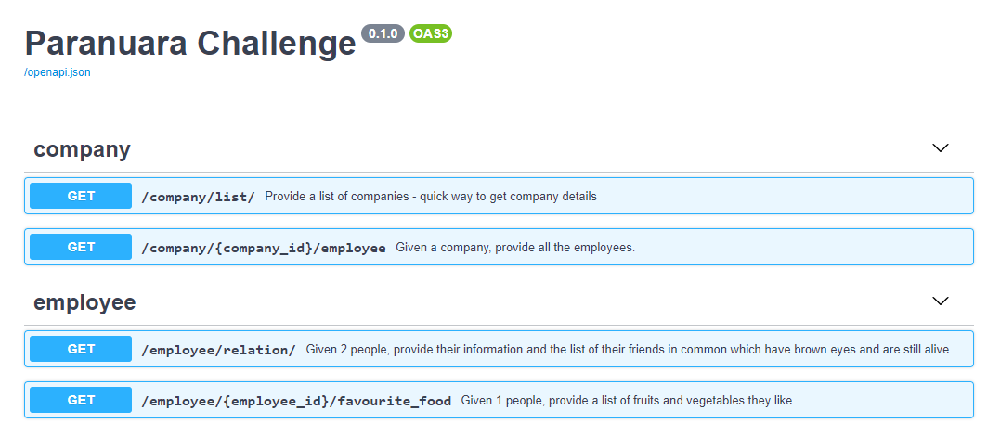
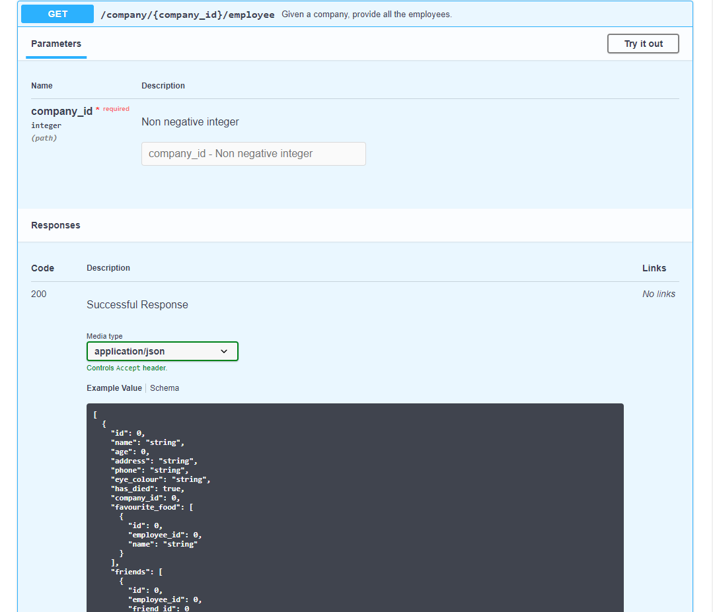
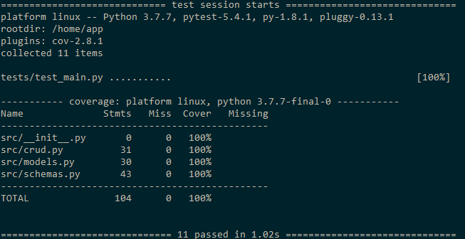

# Paranuara Challenge
Paranuara is a class-m planet. Those types of planets can support human life, for that reason the president of the Checktoporov decides to send some people to colonise this new planet and
reduce the number of people in their own country. After 10 years, the new president wants to know how the new colony is growing, and wants some information about his citizens. Hence he hired you to build a rest API to provide the desired information.

The government from Paranuara will provide you two json files (located at resource folder) which will provide information about all the citizens in Paranuara (name, age, friends list, fruits and vegetables they like to eat...) and all founded companies on that planet.
Unfortunately, the systems are not that evolved yet, thus you need to clean and organise the data before use.
For example, instead of providing a list of fruits and vegetables their citizens like, they are providing a list of favourite food, and you will need to split that list (please, check below the options for fruits and vegetables).

## New Features
Your API must provides these end points:
- Given a company, the API needs to return all their employees. Provide the appropriate solution if the company does not have any employees.
- Given 2 people, provide their information (Name, Age, Address, phone) and the list of their friends in common which have brown eyes and are still alive.
- Given 1 people, provide a list of fruits and vegetables they like. This endpoint must respect this interface for the output: `{"username": "Ahi", "age": "30", "fruits": ["banana", "apple"], "vegetables": ["beetroot", "lettuce"]}`

## Demonstration

The web service is built with [FastAPI](https://fastapi.tiangolo.com/) and [PostgreSQL](https://www.postgresql.org/) is used for the data layer.

The web api and database can be started as [Docker Compose](https://docs.docker.com/compose/) services as following.

```bash
docker-compose up -d
```

Once started, its Swagger document page can be opened on `http://localhost:8000/docs` - use an appropriate hostname or ip address if not running in the local machine. Check the summaries of each endpoints so as to identify the required endpoints.



Requests can be made by unfolding endpoints, hit the *Try it out* button and click the *Execute* button.



The services can be closed as following.

```bash
docker-compose down
```

## Testing

Testing is made with [pytest](https://docs.pytest.org/en/latest/) and it can be done by running Docker Compose services as well.

```bash
docker-compose -f docker-compose-test.yaml up -d
```

The testing output can be printed as shown below.

```bash
docker logs api-test
```



Finally it can be cleaned up as following.

```bash
docker-compose -f docker-compose-test.yaml down
```